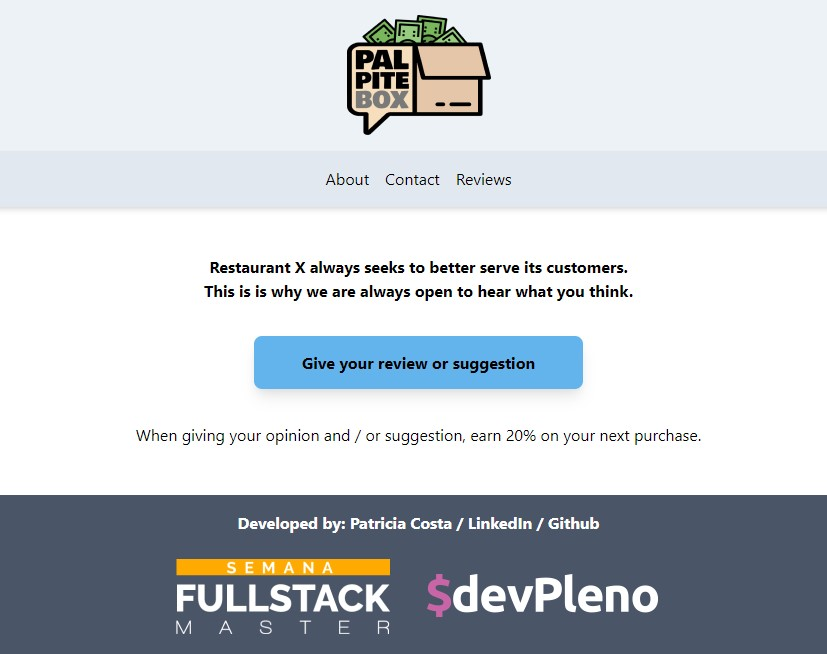

# Palpite Box
<h1 align='center'>
    
</h1>

<p align="center"> Palpite Box App Window<p>

---

### Table of Contents
<!-- You're sections headers will be used to reference location of destination. -->

- [Description](#description)
- [How To Use](#how-to-use)
- [Useful links and resources](#Useful-links-and-resources)
- [License](#license)
- [Author Info](#author-info)

---

## Description

"Palpite Box" was developed during the Fullstack Master Week, a workshop offered by DevPleno and taught by Tulio Faria. 

The application consists of an 'opinion box' ('Palpite Box' in Portuguese), where customers can make evaluations about an establishment and receive a discount coupon in exchange!

The app is connected to a Google Spreadsheet, which works as a database, where the business owner can activate/deactivate a discount, change the discount message, and manage received suggestions/coupons generated.

This is a very affordable, interesting, and easy to use feature that can make your establishment more appealing, while attracting more customers.


#### Technologies

- ReactJS
- Javascript
- NextJS
- Node
- Tailwind CSS
- Google Spreadsheets

[Back To The Top](#palpite-box)

---

## How To Use

* Set a duration for your Focus and Break sessions (or only one of them)
* Press Start button and the timer will start running
* If you set up both Focus and Break sessions, the app will automatically start running your Break session after the Focus session is over
* A sound will play everytime the progress bar is complete / the timer hits 00:00
* You can hit the Stop button at any time to cancel the activty


<!-- #### Installation -->


<!-- 
#### API Reference

```html
    <p>dummy code</p>
```
[Back To The Top](#read-me-template) -->

---

## Useful links and resources

The App was deployed using Vercel, a cloud platform for static sites and Serverless Functions. You can access the app through the link right below:

- https://palpite-box.patriciacvcosta.vercel.app/


[Back To The Top](#palpite-box)

---

## License

MIT License

Copyright &copy; [2020] [Patricia Canuto Vieira da Costa]

[Back To The Top](#palpite-box)

---

## Author Info

- LinkedIn - [Patricia Costa](https://www.linkedin.com/in/patricia-costa-885038a0/)

[Back To The Top](#palpite-box)